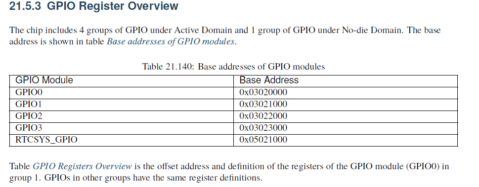
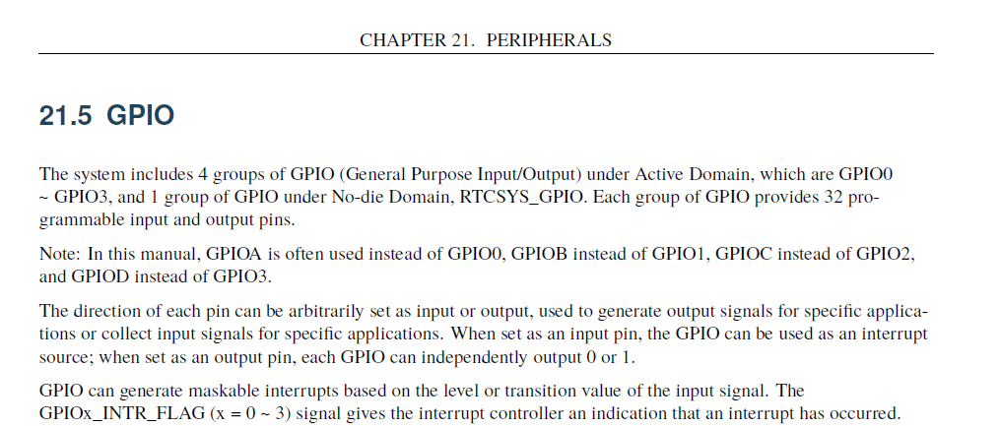
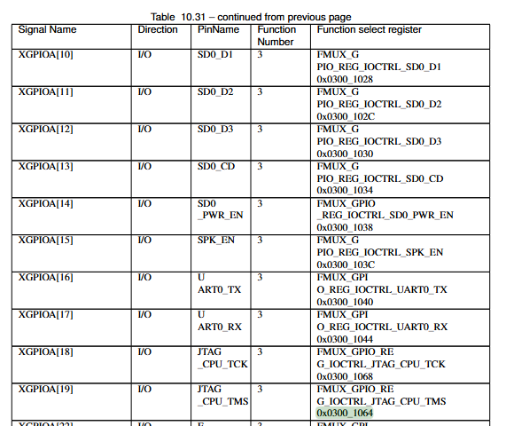
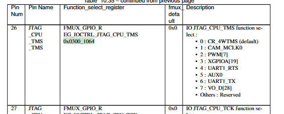

= Работа с GPIO в Linux
:doctype: article
:title-page:
:toc:
:toc-title: Оглавление
:toclevels: 3
:sectnums:
:icons: font
:source-highlighter: rouge
:figure-caption: Рисунок
:table-caption: Таблица
:example-caption: Пример
:listing-caption: Листинг
:pdf-theme: default-with-fallback-font
:author: Владислав Богданов
:email: vla-bogdano@ya.ru
:revdate: 2026-06-05

toc::[]

== Введение:
Данные заметки созданы как дополнительная напоминалка и могут нести ошибки и неверное понимание автором как теории, так и практических полученых данных, а потому если выпытаетесь повторить необходимо осмыслить действия и устройство на котором все воспроизводится. 

Тут вообще написано про gpio и его понимание в linux. 

* "Официальная документация по GPIO" https://origin.kernel.org/doc/html/latest/driver-api/gpio/driver.html 

Практическая часть реализуется при работе с платой `LicheeRV Nano` https://wiki.sipeed.com/hardware/en/lichee/RV_Nano/1_intro.html. 

== Определяемся кто есть кто

=== Смотрим доступные порты   
[bash, console]
----
# ls /sys/class/gpio/
export       gpiochip384  gpiochip448  unexport
gpiochip352  gpiochip416  gpiochip480
----
Мы видим `gpiochipХХХ` и она привязана к адресу порта, сам пин определяется смещением относительно базового, то есть нулевого пина. Количество пинов до 32 (смещение от 0 до 31). 
То есть пин GPIOX_15 = gpiochipХХХ + 15

== Определяемся с портом 
Выполняем следующий код, мы получили  человекочитаемое имя драйвера или контроллера, который управляет этой группой пинов
[bash, console]
----
 Имя драйвера 
# cat /sys/class/gpio/gpiochip480/label
3020000.gpio
Покажет количество пинов (линий), которыми управляет этот чип
# cat /sys/class/gpio/gpiochip480/ngpio
32
 Покажет базовый номер GPIO этого чипа
# cat /sys/class/gpio/gpiochip480/base
480

Современный вариант 
Показывает сводку по всем чипам в системе
# gpiodetect

подробнейшую таблицу по каждому пину внутри чипа
# gpioinfo (или gpiod info в libgpiod v2.x)

Если знаешь имя пина из схемы (например, CAM_GPIO), эта команда мгновенно скажет его точный адрес: gpiochip480 15 (что означает пин 480 + 15 = 495).
gpiofind "имя_пина"
----
далее зайдя в руководство на процессор и сопоставив информацию, получаем четкое понимание (пример из руководства на SG2002). В данном случае я искал GPIOA_15, исходя из принципиальной схемы платы. 

соответствие номеров буквам 

== Управление в режиме ногодрыга

Есть два способа управления устаревший и современный: 

* Устаревший встречается и сейчас. Вроде как использовался на ядрах до 5.10 в новых системах файлы /sys/class/gpio/... могут вообще отсутствовать. 

* Для современного для кода будет нужна установленая библиотека `libgpiod`. Понадобится пакет gpiod (в Debian/Ubuntu: sudo apt install gpiod), метод более безопасен, работает без гонок и рекомендуемый. 

=== Использование как выхода 

==== Пробуем переключать используем устаревший способ 

----
1. "Экспортируем" пин 495 (сообщаем ядру, что будем его использовать)
Если пин уже используется, эта команда выдаст ошибку "Device or resource busy"
# echo 495 | tee /sys/class/gpio/export
495
2. Настраиваем пин как ВЫХОД (out)
# echo out | tee /sys/class/gpio/gpio495/direction
out
3. Записываем значение 0 (LOW / выключить)
# echo 0 | tee /sys/class/gpio/gpio495/value
0
4. Записываем значение 1 (HIGH / включить)
# echo 1 | tee /sys/class/gpio/gpio495/value
1
5. 
# echo 495 | sudo tee /sys/class/gpio/unexport
495
----

[NOTE]
====
1. Для текущего варианта записи может понадобится sudo 
2. Также возможно задавать в таком синтаксисе, но необходим root
[bash, console] 
----
echo 1 > /sys/class/gpio/gpio495/value
----
====
и так у меня один пин под номером 15 работает, а 17 не управляется но он судя по схеме еще может быть задействован как uart0, что очень вероятно и как pwm5, при этом вывод в консоль у обоих пинов аналогичен. 

==== Современный вариант

`не пробовал, пакет у меня не установлен`

Команда gpioset делает всё сразу: захватывает пин, настраивает его на выход и выставляет значение. 

*Вариант А: Установить значение и удерживать его*
По умолчанию gpioset устанавливает значение и сразу завершается, освобождая пин (он вернется в исходное состояние). Чтобы удерживать значение, нужно добавить флаг -b (background) или --mode=wait:
----
# Установить пин 15 на gpiochip480 в 1 (HIGH) и удерживать его
sudo gpioset --mode=wait gpiochip480 15=1

# Чтобы выключить, открой другой терминал и выполни:
sudo gpioset gpiochip480 15=0
# Или нажми Ctrl+C в первом терминале, если используешь --mode=wait

----

*Вариант Б: Установить значение в фоне (удобно для скриптов)*

----
# Включить пин и уйти в фон (пин останется включенным)
sudo gpioset -b gpiochip480 15=1

# Выключить пин (также в фоне)
sudo gpioset -b gpiochip480 15=0
----

=== Использование пина как входа
`Данный код я не проверял`

==== Устаревший вариант 

Разбор отличий устаревших методов:

* direction: Вместо out мы пишем in. Это физически переключает внутреннюю схему контроллера на прием сигнала.

* Чтение (cat): Вместо того чтобы записывать (echo) значение в файл value, мы его читаем с помощью команды cat. Если на пине высокий уровень (HIGH), увидем 1, если низкий (LOW) — 0.

----
# 1. "Экспортируем" пин 495 (сообщаем ядру, что будем его использовать)
echo 495 | sudo tee /sys/class/gpio/export

# 2. Настраиваем пин как ВХОД (in)
echo in | sudo tee /sys/class/gpio/gpio495/direction

# 3. Читаем текущее значение пина (вернет 0 или 1)
cat /sys/class/gpio/gpio495/value

# ... можно читать много раз, например, в цикле ...

# 4. Освобождаем пин (обязательно!)
echo 495 | sudo tee /sys/class/gpio/unexport
----

*Но нельзя делать* бесконечный цикл с cat для опроса кнопки. Это "съест" 100% процессорного времени.
В Linux GPIO есть механизм прерываний (edge detection). Можно сказать ядру: "Разбуди мою программу только тогда, когда сигнал изменится". Для этого используется файл edge:

----
# Доступные значения для edge:
# none   - прерывания отключены (по умолчанию)
# rising - сработает при изменении с 0 на 1 (нажатие кнопки)
# falling- сработает при изменении с 1 на 0 (отпускание кнопки)
# both   - сработает при любом изменении

# Настраиваем пин на реакцию на восходящий фронт (0 -> 1)
echo rising | sudo tee /sys/class/gpio/gpio495/edge
----
После настройки edge, в языках программирования (C, Python) или через утилиты (например, inotifywait в bash) можно эффективно "ждать" изменения сигнала, не нагружая процессор.

==== Современный вариант 

В современном стеке libgpiod есть две основные утилиты для этого, в зависимости от того, что именно нужно: разовое чтение или постоянное отслеживание изменений (например, нажатие кнопки).
Обе команды требуют прав sudo (или прав группы gpio).

*Способ 1: Разовое чтение (gpioget)*

----
sudo gpioget <имя_чипа> <номер_линии>
Пример:
sudo gpioget gpiochip480 15
Результат: В консоли просто выведется 0 (низкий уровень) или 1 (высокий уровень), и программа завершится.
----

*Способ 2: Постоянный мониторинг (gpiomon) (Рекомендуемый)*
Если опрашивать вход (например, кнопку или датчик), использовать gpioget в цикле — это плохая практика (это нагружает процессор и можно пропустить короткое нажатие).
Правильный современный способ — использовать gpiomon. Эта команда не "крутится" в цикле, а засыпает и ждет аппаратного прерывания от ядра, когда состояние пина изменится. Это максимально эффективно.

*Синтаксис:*

----
sudo gpiomon <имя_чипа> <номер_линии>
sudo gpiomon gpiochip480 15
----
*Что произойдет:*

Команда "зависнет" и будет ждать. Как только изменится напряжение на пине (например, замкнешь кнопку на землю или на 3.3В), в консоли мгновенно появится строка:
----
event:  FALLING EDGE offset: 5 timestamp: [1690000000.123456789]
или 
event:  RISING EDGE offset: 5 timestamp: [1690000000.987654321]
----

* *RISING EDGE* — переход из 0 в 1 (напряжение появилось).

* *FALLING EDGE* — переход из 1 в 0 (напряжение пропало).

Чтобы остановить мониторинг, нажми Ctrl+C.

*Важный нюанс: "Висящий" пин (Floating)*

Если пин настроен как вход, и к нему ничего не подключено, он находится в "висящем" состоянии. Из-за электромагнитных наводок он будет хаотично менять значения между 0 и 1.
Чтобы этого избежать, применяют внутренние подтягивающие резисторы (pull-up / pull-down).
В новых версиях libgpiod (v2.x и выше) их можно включить прямо из консоли флагом --bias:

*Пример с подтяжкой к питанию (Pull-up):*

(Пин будет читать 1, пока не замкнуть его на землю кнопкой)

----
sudo gpiomon --bias=pull-up gpiochip480 15
----

*Пример с подтяжкой к земле (Pull-down):*

(Пин будет читать 0, пока не подать на него 3.3В)

----
sudo gpiomon --bias=pull-down gpiochip480 15
----
[NOTE]

====
 Если версия gpiod старая и не знает флаг --bias, подтяжку придется настраивать через Device Tree или специальную утилиту производителя платы, например raspi-gpio для Raspberry Pi
====

== Что то не работает
Данная команда покажет:

* Какие контроллеры GPIO зарегистрированы в системе

* Какие пины (линии) GPIO существуют

* Текущее состояние каждого пина (вход/выход, высокий/низкий уровень)

* Каким драйвером или процессом используется каждый пин

* Если пин настроен как прерывание — показывает триггер и счётчик срабатываний

* 2> /dev/null — перенаправляет поток ошибок (stderr, дескриптор 2) в «чёрную дыру» /dev/null. Это подавляет сообщения об ошибках (например, если файла не существует или нет прав на чтение).

[bash, console]
----
# cat /sys/kernel/debug/gpio 2> /dev/null
gpiochip4: GPIOs 352-383, parent: platform/5021000.gpio, 5021000.gpio:
 gpio-353 (                    |snsr-rst-gpio       ) in  lo
 gpio-355 (                    |GTP INT IRQ         ) in  lo IRQ
 gpio-356 (                    |GTP RST PORT        ) out hi

gpiochip3: GPIOs 384-415, parent: platform/3023000.gpio, 3023000.gpio:

gpiochip2: GPIOs 416-447, parent: platform/3022000.gpio, 3022000.gpio:

gpiochip1: GPIOs 448-479, parent: platform/3021000.gpio, 3021000.gpio:
 gpio-449 (                    |scl                 ) out hi
 gpio-450 (                    |sda                 ) in  lo
 gpio-454 (                    |cviusb-otg          ) in  hi IRQ

gpiochip0: GPIOs 480-511, parent: platform/3020000.gpio, 3020000.gpio:
 gpio-493 (                    |cvi-cd              ) in  lo IRQ ACTIVE LOW
 gpio-494 (                    |led-user            ) out lo
 gpio-510 (                    |User Key            ) in  hi IRQ ACTIVE LOW

----

Таким образом мы видим:

* пин  `gpio-494` который задействован драйвером led 494-480 = GPIOA_14.

* пин  `gpio-510` который задействован драйвером кнопки 510-480 = GPIOA_30.

* Что совпадает со схемой. Остальные не рассмативаю.  

У меня не работает GPIOA_17 (gpio-480+17 = gpio_497), его здесь нет, с
Проверяю также на GPIOA_19 (gpio-480+19 = gpio_499), ситуация аналогичная думаю пин задействован другой переферией. 

*Проверяем что пин не в режиме входа*
----
# echo 499 | teee /sys/class/gpio/export
-sh: teee: not found
# echo 499 | tee /sys/class/gpio/export
499
# cat /sys/class/gpio/gpio499/direction
in
# echo out > /sys/class/gpio/gpio499/direction
# cat /sys/class/gpio/gpio499/direction
out
# echo 0 > /sys/class/gpio/gpio499/value
# echo 0 > /sys/class/gpio/gpio499/value
# cat /sys/class/gpio/gpio499/value
1
----

=== Не много теории 
`Pin Multiplexing` - механизм определяющий какая цифровая переферия подключена к конкретной ножке чипа.

*Как это работает:*
На каждый вывод приходится N функций (режимов ALT0...ALT15). Регистр мультиплексора хранит число, выбирающее активную функцию.

*Пример для вывода X:*

0000 = GPIO (обычный порт ввода-вывода)

0001 = UART3_TX (передатчик третьего UART)

0010 = I2C1_SDA (линия данных первого I2C)

0011 = TIM2_CH1 (канал ШИМ таймера)

*Важный нюанс:* Пиновый мультиплексор управляет только цифровым сигналом. Вы не можете с помощью мультиплексора превратить цифровой вывод напрямую в аналоговый вход АЦП, минуя аналоговый блок (хотя выбор режима ADC — это тоже функция мультиплексора).

`Pin Control` - Механизм настройки электрических характеристик и поведения вывода после того, как функция выбрана (или даже во время выбора).

*Что конфигурируется (зависит от чипа):*

Pull-up / Pull-down: Подтяжка линии к питанию или земле, чтобы вывод не "висел в воздухе".

Drive Strength (Сила тока): Настройка выходного тока (например, 2 мА, 4 мА, 8 мА). Важно для согласования импеданса (излучение помех EMI) и достаточности тока для светодиодов/нагрузок.

Slew Rate Control: Управление скоростью нарастания фронта сигнала (быстрый/медленный). Медленный фронт снижает звон и помехи, быстрый нужен для скоростных интерфейсов.

Input Schmitt Trigger: Включение гистерезиса на входе для подавления дребезга (нужно для кнопок, не нужно для быстрых линий данных).

Open-Drain / Push-Pull: Режим работы выхода (открытый сток или двухтактный).

Bias / Receiver Enable: Отключение входного буфера, когда вывод работает на выход, для экономии энергии.

*Как это выглядит в Linux (Device Tree)*

В Linux эти понятия чаще всего объединяются в макросах в Device Tree, но логически они разделены. Стандартное свойство — pinctrl.

Обычно конфигурация одного пина выглядит как комбинация мультиплексирования и контроля, записанная в одном 32-битном слове:
[c]
----
// Пример для i.MX SoC
pinctrl_uart1: uart1grp {
    fsl,pins = <
        /* Пин | Мультиплексирование (MUX) | Контроль (PAD) */
        MX6QDL_PAD_SD3_DAT7__UART1_TX_DATA   0x1b0b1
        MX6QDL_PAD_SD3_DAT6__UART1_RX_DATA   0x1b0b1
    >;
};
----

Здесь:

MX6QDL_PAD_SD3_DAT7__UART1_TX_DATA — это MUX: макрос говорит "возьми пин, который по умолчанию является 7-й линией данных SD-карты, и переключи его мультиплексор в режим передатчика UART1".

0x1b0b1 — это Pin Control: битовая маска, которая записывается в PAD-регистр и задает параметры: Pull-Up, Slew Rate (медленный), Drive Strength (сильный). Обычно расшифровывается в Reference Manual на процессор.

*Архитектура в ядре Linux*
 
Подсистема pinctrl логически разносит эти понятия на два уровня драйвера:

*Pin Controller Driver:* Отвечает за регистры мультиплексирования. Регистрирует возможные функции и группы пинов.

*GPIO Driver:* Часто тесно переплетен, так как режим GPIO — это одна из функций мультиплексора.

*Pin Configuration Driver:* Применяет электрические настройки (pin_config).

В коде это вызовы типа pinconf_set_config(), а в Device Tree есть возможность разделять MUX и CONFIG:

[devicetree]
----
/*devicetree*/
pinctrl-single,pins = <
    /* Смещение MUX */
    0x108 ( PIN_OUTPUT | MUX_MODE3 )
>;
pinctrl-single,bias-pullup = <0x108 0x00 0x08>;
----

=== Ищем что там назначено

Открываем таблицу Pin Multiplexing 
1. Ищу GPIO_A19, далее 

 

судя по всему 0x0300_1064 соответствует адресу где хранится заданное значение, с помощью команды читаем что там 
----
devmem 0x03001064
0х00000004
----

теперь пробегаемся по документу ищем  0x0300_1064 где  Function Number равен 4.

 

В даном документе нашлась еще одна табличка как я понимаю там назначен *uart1_rts*

поэтому переназначем этот пин путем записи по этому адресу значения 3, так как согласно таблицы именно оно и соответствует функции gpio.

----
# devmem 0x03001064 32 3
// читаем обратно 
# devmem 0x03001064
0x00000003
----
 
Пробуем управлять 

----
# echo 1 | tee /sys/class/gpio/gpio499/value
1
# echo 0 | tee /sys/class/gpio/gpio499/value
0
----
*Работает, 19 пин переключается, 17 пин тоже управляется!*

=== А как нужно 
Данный метод подходит для отладки, как же нужно поступать при разработке: 

* Модификация Device Tree Source (DTS) файла
----
&uart1 {
    status = "disabled";  // Или убрать pinctrl-0 = <&uart1_pins>;
};

&pio {
    gpio499 {
        gpio-hog;
        gpios = <19 GPIO_ACTIVE_HIGH>;
        output-low;
        line-name "my-custom-gpio";
    };
};
----

*  Device Tree Overlay (если поддерживается)
Динамическая загрузка оверлея без пересборки всего образа.
Подробное расссмотрение будет в отдельном файле. 

*  Отключение драйвера (компромиссный вариант)
Если UART не нужен, можно отключить его через bootargs:

----
# В /boot/cmdline.txt или boot.scr
console=ttyS0,115200 earlycon=sbi
# И не упоминать uart1 вообще
----
Или выгрузить модуль:
----
rmmod 8250_of  # или другой драйвер UART
----

* Создать скрипт инициализации

Если ядро не позволяет менять Device Tree на лету, мы говорим системе: "Сделай это через 2 секунды после загрузки, пока пользователь еще даже не успел залогиниться".
